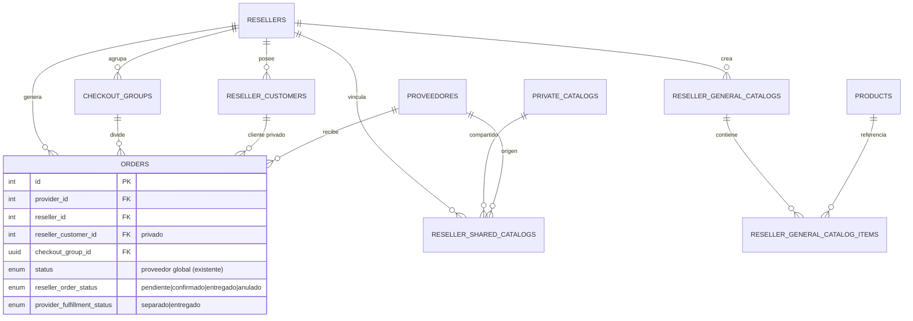

# Design — App móvil de Revendedores (Flutter)

> Acompaña a `requirements.md`. Define arquitectura Flutter, cambios de backend, modelo de datos, seguridad/privacidad y contratos de API por fase.
> Proyecto Flutter: `/mnt/ssd_secundario/Repositorios/ios-catalogos/catalogos`. Backend: NestJS + TypeORM + PostgreSQL. Firebase: `surtte-4bf22`.

## 1. Visión general

La app es **primariamente para el revendedor**. El backend se **extiende** (no se reemplaza) para soportar: cuenta/rol `reseller`, vinculación de catálogos compartidos por teléfono, catálogos generales con margen, clientes privados, pedidos con doble estado (revendedor/proveedor) y checkout group multi-proveedor.

Principios:
- Reutilizar lo existente (`orders`, `private_catalogs`, vistas públicas de catálogo, auth Firebase).
- Aislamiento estricto de datos del revendedor frente al proveedor.
- Backend como fuente de verdad de precios del proveedor; el margen del revendedor se calcula y se persiste a nivel de catálogo general.
- Diseño por entornos (dev/staging/prod); nunca pruebas destructivas en prod.

---

## 2. Arquitectura Flutter

### 2.1 Capas (feature-first + Clean-lite)
```
catalogos/lib/
  main.dart                      # bootstrap: Firebase, App Check, env, runApp
  app/
    app.dart                     # MaterialApp.router
    theme/                       # ThemeData FlyStock (Poppins + paleta)
    router/                      # go_router + guards de auth/rol
    env/                         # Environment (dev/staging/prod) + flavors
  core/
    network/                     # Dio + AuthInterceptor (idToken) + AppCheckInterceptor + error mapping
    storage/                     # secure storage (sesión) + cache (hive/drift) para offline
    result/                      # Result<T>/Either, Failure types
    utils/                       # money (COP), phone (E.164), whatsapp link
  features/
    auth/                        # login OTP, perfil reseller
    shared_catalogs/             # catálogos recibidos (lista, detalle, cache)
    orders/                      # crear pedido, listado, estados del revendedor
    customers/                   # clientes privados (CRUD, selección en pedido)
    general_catalog/             # catálogos generales, margen, portada, checkout on/off
    provider_view/               # (opcional móvil) vista proveedor: separado/entregado
    notifications/               # FCM token, handlers
    profile/
  shared/
    widgets/                     # botones FlyStock, estados vacío/carga/error
    models/                      # modelos compartidos
```

Cada feature: `data/` (datasources, DTOs, repos impl) · `domain/` (entities, repo interfaces, usecases ligeros) · `presentation/` (pages, widgets, controllers/providers).

### 2.2 Gestión de estado
- **Riverpod** (riverpod + flutter_riverpod) con `AsyncNotifier`/`Notifier`.
- Rationale: inyección de dependencias simple, testeable, buen manejo de estados async (loading/data/error) alineado con UX-3.

### 2.3 Navegación
- **go_router** con rutas tipadas y **redirect guards**: no autenticado → login; autenticado sin perfil → completar perfil; rutas de proveedor protegidas por rol.

### 2.4 Capa de datos y red
- **Dio** con interceptores:
  - `AuthInterceptor`: adjunta `Authorization: Bearer <firebaseIdToken>` (refresco automático; reintento único ante 401, equivalente a `secureFetch.ts`).
  - `AppCheckInterceptor`: adjunta token de App Check en endpoints protegidos.
  - `ErrorInterceptor`: mapea HTTP → `Failure` (network, auth, validation, server, rateLimited 429).
- Base URL por entorno (`Environment.apiBaseUrl`).
- **Serialización:** `freezed` + `json_serializable`.

### 2.5 Caché / offline (UX-3)
- **drift** (SQLite) o **hive** para cachear catálogos compartidos y productos consultados (lectura offline).
- Estrategia **stale-while-revalidate**: muestra caché y refresca en background.
- La **creación de pedidos requiere conexión**; si no hay red, se bloquea con mensaje (sin cola offline en v1).

### 2.6 Manejo de errores
- `Result<T>` en repos; UI consume `AsyncValue`.
- Widgets consistentes de error/empty/loading en `shared/widgets`.
- 429 (rate limit) → backoff y mensaje; 401 persistente → cerrar sesión.

### 2.7 Configuración por entornos
- **Flavors** Flutter: `dev`, `staging`, `prod` (Android product flavors + iOS schemes/xcconfig).
- `--dart-define-from-file` con `env/dev.json|staging.json|prod.json` (apiBaseUrl, firebaseOptions ref, flags).
- Nunca commitear secretos; `firebase_options_*.dart` generados por FlutterFire se referencian por flavor.

### 2.8 Identidad visual (UX-1)
- `ThemeData` con `fontFamily: 'Poppins'` y `ColorScheme` derivado de: primario `#001634`, secundario `#004aad`, acento `#5de0e6`, brand `#00ff94`; fondo `#f8f9fa`, texto `#212529`.
- Botón primario con gradiente `#004aad → #5de0e6 → #00ff94` como widget propio.

---

## 3. Modelo de datos (cambios de backend)

> Todas las migraciones usan TypeORM, `synchronize:false`, siguiendo el patrón de `backend/migrations`. Nombres `snake_case`.

### 3.1 Nuevas tablas

**`resellers`** (N-1)
| columna | tipo | notas |
|---|---|---|
| id | pk serial | |
| firebase_uid | varchar unique | liga a Firebase |
| telefono_e164 | varchar unique | normalizado |
| nombre | varchar null | perfil |
| country_code | varchar(2) default 'CO' | |
| created_at / updated_at | timestamp | |

**`reseller_shared_catalogs`** (N-2) — vínculo reseller ↔ catálogo compartido
| columna | tipo | notas |
|---|---|---|
| id | pk | |
| reseller_id | fk → resellers | |
| catalog_id | uuid fk → private_catalogs | |
| provider_id | int fk → proveedores | denormalizado para filtros |
| linked_at | timestamp | |
| unique(reseller_id, catalog_id) | | idempotencia |

**`reseller_general_catalogs`** (CG-1/CG-2/R4.3)
| columna | tipo | notas |
|---|---|---|
| id | pk uuid | |
| reseller_id | fk | |
| nombre | varchar | |
| cover_url | varchar null | portada S3 |
| checkout_enabled | boolean default false | R4.3 |
| default_margin_type | enum('percent','fixed','none') default 'percent' | |
| default_margin_value | decimal null | |
| created_at/updated_at | | |

**`reseller_general_catalog_items`** (CG-1/CG-2/CG-3)
| columna | tipo | notas |
|---|---|---|
| id | pk | |
| general_catalog_id | fk | |
| product_id | uuid fk → products | |
| provider_id | int fk | para split por proveedor |
| order_index | int default 0 | reordenar |
| margin_type | enum('percent','fixed','inherit') default 'inherit' | override |
| margin_value | decimal null | |
| unique(general_catalog_id, product_id) | | |

**`reseller_customers`** (clientes privados)
| columna | tipo | notas |
|---|---|---|
| id | pk | |
| reseller_id | fk | dueño |
| nombre | varchar | |
| celular | varchar | |
| direccion / ciudad / departamento | varchar null | |
| nit_cedula | varchar null | |
| is_deleted | boolean default false | borrado lógico |
| created_at | timestamp | |

**`checkout_groups`** (P1 — agrupador multi-proveedor)
| columna | tipo | notas |
|---|---|---|
| id | pk uuid | |
| reseller_id | fk | |
| general_catalog_id | fk null | origen |
| reseller_customer_id | fk → reseller_customers null | cliente privado |
| total_cliente | decimal | suma precios con margen |
| created_at | timestamp | |

**`device_tokens`** (FCM, Nt-1)
| columna | tipo | notas |
|---|---|---|
| id | pk | |
| owner_type | enum('reseller','provider') | |
| owner_id | int | |
| fcm_token | varchar | |
| platform | enum('android','ios') | |
| updated_at | timestamp | unique(fcm_token) |

### 3.2 Cambios a tablas existentes

**`usuarios.rol`**: añadir valor `revendedor` al enum (migración de enum). El `reseller` vive en su tabla propia, pero el enum habilita autorización coherente.

**`orders`** (P4 — extender, no duplicar):
- `reseller_id` int fk → resellers (null para pedidos no-revendedor).
- `reseller_order_status` enum('pendiente','confirmado','entregado','anulado') null.
- `provider_fulfillment_status` enum('separado','entregado') null (independiente de `status`).
- `reseller_customer_id` int fk → reseller_customers null (**privado**; nunca serializado hacia el proveedor).
- `checkout_group_id` uuid fk → checkout_groups null.
- `price_source` enum('provider') default 'provider' (el total hacia el proveedor usa precio del proveedor).

> El `order.status` existente (máquina del proveedor global) se conserva. Los nuevos campos son ortogonales.

### 3.3 Diagrama ER (estado objetivo, resumido)



---

## 4. Contratos de API (nuevos / extendidos)

> Prefijo sugerido `/reseller/*` para endpoints del revendedor. Auth: `FirebaseAuthGuard` + guard de rol `reseller`. App Check en públicos.

### Fase 1 — Auth + catálogos compartidos
- `POST /auth/login` (existente) — reutilizar; detectar/crear `reseller`. Respuesta incluye `tipo: 'REVENDEDOR'` cuando aplica.
- `POST /reseller/sync-shared-catalogs` — body: `{}` (usa el teléfono del token). Vincula `private_catalogs` por teléfono E.164. Idempotente. Respuesta: `{ linked: n, catalogs: [...] }`.
- `GET /reseller/me` — perfil del revendedor.
- `PATCH /reseller/me` — actualizar nombre/datos.
- `GET /reseller/me/shared-catalogs?providerId=&search=` — catálogos vinculados.
- Reutilizar vistas públicas: `GET /catalog/by-catalog/:id/products`, `POST /catalog/products/previews`, `GET /catalog/short/:shortUuid`.

### Fase 2 — Pedidos y estados
- `POST /reseller/orders` — crea pedido (un proveedor). body: `{ providerId, items[], resellerCustomerId?, notes? }`. Crea `order` con `reseller_id`, `reseller_order_status='pendiente'`.
- `GET /reseller/me/orders?status=&providerId=&page=&limit=` — listado con proveedor + ambos estados.
- `GET /reseller/orders/:id` — detalle (solo dueño).
- `PATCH /reseller/orders/:id/status` — body `{ status }`. Valida transición; rechaza si `anulado`.

### Fase 3 — Clientes privados
- `GET /reseller/customers?q=&page=` · `POST /reseller/customers` · `PATCH /reseller/customers/:id` · `DELETE /reseller/customers/:id` (lógico).
- Todos filtran por `reseller_id` del token. **Ningún** endpoint de proveedor devuelve `reseller_customers`.

### Fase 4 — Catálogo general
- CRUD `GET/POST/PATCH/DELETE /reseller/general-catalogs[/:id]`.
- `POST /reseller/general-catalogs/:id/items` (agregar producto) · `POST /reseller/general-catalogs/:id/items/bulk` (atajo "todo el catálogo de un proveedor") · `PATCH .../items/:itemId` (margen/orden) · `DELETE .../items/:itemId`.
- `PATCH /reseller/general-catalogs/:id` — `checkout_enabled`, `default_margin_*`, `nombre`.
- Portada: `POST /reseller/general-catalogs/:id/cover/signed-url` → S3 presign (reutiliza patrón banner) · `POST .../cover/confirm`.
- `POST /reseller/general-catalogs/:id/checkout` — body `{ items[], resellerCustomerId? }`. Si `checkout_enabled`: crea `checkout_group` + N `orders` (split por `provider_id`). Si OFF: devuelve payload para WhatsApp (no crea orders).
- `GET /reseller/checkout-groups/:id` — grupo + subpedidos.

### Fase 5 — Proveedor
- `GET /provider/reseller-orders?status=&page=` — pedidos de revendedores del proveedor (sin cliente privado).
- `PATCH /orders/:id/provider-fulfillment` — body `{ fulfillment: 'separado'|'entregado' }`. Guard: proveedor dueño. **No** toca `reseller_order_status`.
- Garantizar en el serializer que `reseller_customer_id`/datos del cliente privado **no** se incluyan en respuestas al proveedor.

### Fase 6 — Notificaciones
- `POST /reseller/devices` / `POST /provider/devices` — registrar/actualizar `fcm_token`.
- Backend emite FCM: a proveedor en pedido nuevo; a revendedor en cambio de `provider_fulfillment_status`.

---

## 5. Cálculo de precios y margen (CG-3)

- **Precio proveedor (costo):** viene de `products.precios` (mapa cantidad→precio) según `price_field`.
- **Precio cliente (revendedor):**
  - `percent`: `precioCliente = precioProveedor * (1 + margin_value/100)`.
  - `fixed`: `precioCliente = margin_value` (precio de venta fijo).
  - `inherit` (item): usa `default_margin_*` del catálogo general.
  - `none`: `precioCliente = precioProveedor`.
- **Regla de exposición:** las respuestas de catálogo general / checkout hacia el **cliente final** devuelven solo `precioCliente`. El `precioProveedor` solo se usa internamente y en el pedido hacia el proveedor.
- **Recalculo:** el precio cliente se calcula on-read a partir de costo actual + regla (R4.2.4). El `fixed` se conserva aunque cambie el costo.
- **Redondeo:** COP sin decimales (UX-2), usando `NumberFormat` es-CO en Flutter y entero en backend.

## 6. Checkout split multi-proveedor (P1 / R4.4)

Flujo `POST /reseller/general-catalogs/:id/checkout` con `checkout_enabled=true`:
1. Agrupar `items` por `provider_id`.
2. Crear `checkout_group` (reseller_id, general_catalog_id, reseller_customer_id, total_cliente).
3. Por cada grupo de proveedor: crear `order` con `reseller_id`, `checkout_group_id`, `provider_id`, `reseller_order_status='pendiente'`, items con precio **del proveedor** (costo). El total "cliente" se guarda a nivel de grupo/línea para el revendedor.
4. Emitir FCM a cada proveedor (pedido nuevo).
5. Devolver `{ checkoutGroupId, orders:[...] }`.

Con `checkout_enabled=false`: no se crean orders; se devuelve el mensaje/payload para abrir WhatsApp hacia el cliente final (precios con margen).

## 7. Seguridad y privacidad (RT.1)

- **Validación idToken:** todos los endpoints `/reseller/*` y `/provider/*` pasan por `FirebaseAuthGuard` (verifica `idToken`).
- **Autorización por rol + propiedad:** guard `ResellerGuard` resuelve `reseller` por `firebase_uid`; cada query filtra por `reseller_id`. Guard de proveedor filtra por `provider_id`.
- **Aislamiento de clientes privados (R3.2):**
  - `reseller_customers` nunca se incluye en endpoints `/provider/*`.
  - Serializer de pedidos del proveedor **omite** `reseller_customer_id` y datos derivados.
  - Pruebas de API obligatorias: un proveedor autenticado NO puede leer `reseller_customers` ni ver cliente en su pedido (test negativo).
- **App Check (A-3):** interceptor en móvil; backend valida App Check donde reemplaza reCAPTCHA (p. ej. endpoints públicos de red de ventas).
- **Transiciones de estado:** validadas en servicio (anulado = terminal); el proveedor no puede escribir `reseller_order_status` y viceversa (guards distintos + columnas distintas).
- **Secretos:** sin credenciales en el repo Flutter; `firebase_options` por flavor; backend sigue usando AWS Secrets Manager.

## 8. Offline / caché (UX-3)

- Cachear: lista de catálogos compartidos, detalle de catálogo, previews de productos.
- No cachear datos sensibles de clientes más allá de la sesión segura.
- Crear pedido / checkout: requieren red; si offline, deshabilitar acción con aviso.

## 9. Notificaciones (Nt-1)

- `firebase_messaging` en Flutter; registrar token tras login (`POST /reseller/devices`).
- Manejo foreground/background/terminated; deep link a detalle de pedido.
- Backend dispara FCM en: pedido nuevo (→ proveedor), cambio de `provider_fulfillment_status` (→ revendedor).

## 10. Riesgos y mitigaciones (resumen)

- **Re-sincronización de catálogos por teléfono:** correr sync en login y vía endpoint manual; idempotente por `unique(reseller_id, catalog_id)`.
- **Cambios de costo del proveedor vs margen fijo:** documentar regla (percent recalcula, fixed conserva).
- **Fuga de cliente privado:** cubrir con tests de contrato en backend antes de exponer endpoints del proveedor.
- **Staging no confirmado (RE-2):** desarrollar contra dev/mock; no ejecutar escrituras contra prod.
- **App Check en Firebase existente:** requiere configuración del proyecto `surtte-4bf22` (pasos manuales en tasks).

## 11. Dependencias Flutter propuestas

`firebase_core`, `firebase_auth`, `firebase_app_check`, `firebase_messaging`, `dio`, `go_router`, `flutter_riverpod`, `riverpod_annotation`, `freezed`/`json_serializable`, `intl`, `cached_network_image`, `url_launcher`, `image_picker`, `image_cropper`, `drift` (o `hive`), `flutter_secure_storage`, `flutter_dotenv`/dart-define. Dev: `build_runner`, `mocktail`, `flutter_lints`.
