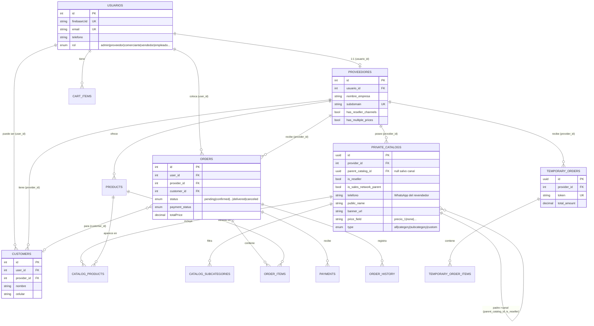

# 00 — Análisis de contexto: App móvil para Revendedores (Flutter)

> Documento de solo análisis. No se modificó ningún repo de origen. Todas las rutas citadas son evidencia leída directamente del código.
> Fecha: 2026-10-01.

---

## 1. Resumen ejecutivo (máx. 15 líneas)

1. El backend es **NestJS 10 + TypeScript + TypeORM 0.3 + PostgreSQL**, monolito modular (~40 módulos), sin Swagger/OpenAPI. Evidencia: `surtte/main/backend/package.json`, `src/app.module.ts`.
2. La **autenticación es por Firebase**: el cliente obtiene un `idToken` de Firebase Auth y el backend lo verifica con `firebase-admin`. No hay JWT propio ni OTP gestionado por el backend. Evidencia: `src/modules/auth/auth.service.ts`, `flystock-catalogos/src/utils/secureFetch.ts`.
3. **Ya existe el concepto de "Red de ventas" / "revendedor" (afiliado)**, pero modelado como filas hijas de `private_catalogs` que pertenecen al **proveedor**, no como una cuenta propia del revendedor. Evidencia: `src/modules/private-catalogs/entities/private-catalog.entity.ts`.
4. La **compartición por número de celular** existe: el proveedor da de alta afiliados por teléfono (canal de venta) y el afiliado "reclama" su enlace en una página pública ingresando su WhatsApp. Evidencia: `private-catalogs.controller.ts`, `private-catalogs.claim-affiliate.spec.ts`.
5. **NO existe** una cuenta de revendedor que **acumule catálogos de varios proveedores**, ni un **catálogo general multi-proveedor**, ni **clientes privados del revendedor**, ni **estados de pedido separados** proveedor/revendedor. Evidencia: `src/modules/orders/entities/order.entity.ts` (estado único), `customers/entity/customer.entity.ts` (cliente ligado a `provider`).
6. El **checkout actual del catálogo compartido es por WhatsApp** (arma un mensaje), con opción de ocultar precios en modo canal de venta. Evidencia: `flystock-catalogos/src/utils/whatsappCatalog.ts`.
7. El rol `revendedor` **no existe** en el enum de roles; el usuario base al registrarse es `COMERCIANTE`. Evidencia: `src/modules/users/entity/user.entity.ts` (`RolUsuario`).
8. Identidad visual = marca **FlyStock**: tipografía Poppins, azul oscuro `#001634`, azul `#004aad`, cian `#5de0e6`, verde `#00ff94`. Evidencia: `flystock-catalogos/src/index.css`.
9. El proyecto Flutter destino existe en `ios-catalogos/catalogos` pero es el **template por defecto** (contador). Flutter 3.47.4 / Dart 3.13.3 instalados. Targets: android, ios, linux, macos, web, windows.
10. **Conclusión:** la base de "red de ventas" es reutilizable como punto de partida, pero los requisitos centrales de la app (cuenta propia del revendedor, multi-proveedor, catálogo general, clientes privados, doble estado de pedido) requieren **nuevas tablas, endpoints y migraciones** en el backend.

---

## 2. Hallazgos del backend (A.1 – A.10)

Ruta base del repo: `/mnt/ssd_secundario/Repositorios/surtte/main/backend`.

### A.1 Stack, framework, lenguaje, ORM, BD, estructura, versión
- **Framework:** NestJS `^10` (`@nestjs/core`, `@nestjs/common`). **Lenguaje:** TypeScript `^5.1`. Evidencia: `package.json`.
- **ORM:** TypeORM `^0.3.21` con `@nestjs/typeorm`. **BD:** PostgreSQL (driver `pg ^8.14`). Evidencia: `package.json`, `src/app.module.ts`.
- **Config BD:** `synchronize: false`, `autoLoadEntities: true`, credenciales vía **AWS Secrets Manager** (`SecretId: 'CredencialesBD'`, región `us-east-2`), SSL con CA en `/app/rds-ca.pem`. Evidencia: `src/app.module.ts` (`getDatabaseSecrets`).
- **Estructura:** monolito modular en `src/modules/*` (~40 módulos: `auth`, `users`, `providers`, `products`, `orders`, `customers`, `private-catalogs`, `cart`, `share`, `distributors`, `payments`, `wompi`, `notification(s)`, `taxxa`, etc.). Entrypoint `src/main.ts`.
- **Otros:** Socket.IO (`@nestjs/websockets`), tareas programadas (`@nestjs/schedule`), AWS S3/SES/MediaConvert, Firebase Admin, MercadoPago, generación de PDF/Excel. Hay microservicio FastAPI externo opcional (`FASTAPI_URL`, remoción de fondos). Evidencia: `package.json`, `src/main.ts`.
- **Versión del paquete:** `0.0.1` (`package.json`).

### A.2 Autenticación
- **Flujo:** el cliente autentica contra **Firebase Auth** y envía `idToken`; `POST /auth/login` lo verifica con `admin.auth().verifyIdToken()`. Evidencia: `src/modules/auth/auth.controller.ts`, `src/modules/auth/auth.service.ts`.
- Se protege con **reCAPTCHA Enterprise** opcional (`recaptchaToken`). Evidencia: `auth.controller.ts`.
- El guard `FirebaseAuthGuard` valida el `Bearer <firebaseIdToken>` en cada request protegido; el `@nestjs/jwt` existe en deps pero el login principal **no** emite un JWT propio. Evidencia: `common/guards/firebase-auth.guard.ts` (referenciado en controladores), `secureFetch.ts` (frontend adjunta `Authorization: Bearer <idToken>`).
- **Resolución de identidad en login** (`auth.service.ts`): busca en `usuarios` por `firebaseUid`; si es `PROVEEDOR` devuelve permisos `ALL`; si no, busca en `store_users` (empleados, rol `VENDEDOR`); si no existe, **crea un usuario nuevo como `COMERCIANTE`**. Soporta `partnerCode` para referidos.
- **Login por teléfono / OTP:** no es gestionado por el backend. Se asume que Firebase (en el cliente) maneja el método (teléfono/OTP, email, etc.). El backend solo ve el `idToken`. **NO ENCONTRADO** un endpoint propio de envío/verificación de OTP.
- **Concepto de revendedor/reseller como rol:** **NO ENCONTRADO** en `RolUsuario`. Roles existentes: `admin, verificador, moderador, soporte, proveedor, comerciante, vendedor, empleado`. Evidencia: `src/modules/users/entity/user.entity.ts`.

### A.3 Modelo de datos relevante (ver diagrama ER en §4)
Entidades leídas directamente:
- **`usuarios`** (`User`): `id`, `firebaseUid` (unique), `nombre`, `email` (unique), `telefono`, `rol` (`RolUsuario`), `isPartner`, `countryCode`. Relaciones: `proveedorInfo` (1:1 `Provider`), `orders`, `customers`, `cartItems`. Evidencia: `modules/users/entity/user.entity.ts`.
- **`proveedores`** (`Provider`): `id`, `usuario` (1:1), `nombre_empresa`, `logo_url`, `banner_url` (+ variantes optimizadas), `telefono`, `subdomain` (unique), flags premium `has_reseller_channels`, `has_multiple_prices`, `has_multiple_numbers`, `has_private_catalog`. Evidencia: `modules/providers/entity/provider.entity.ts`.
- **`private_catalogs`** (`PrivateCatalog`): catálogo privado del proveedor. Campos clave para red de ventas: `parent_catalog_id`, `is_reseller` (fila = canal de un revendedor), `is_sales_network_parent` (catálogo padre), `telefono` (WhatsApp propio del revendedor), `public_name`, `banner_url`, `og_image_url`, `price_field` (`precio_1`/`none`/...), `layout`, `type` (`all|category|subcategory|custom`). Evidencia: `modules/private-catalogs/entities/private-catalog.entity.ts`.
- **`catalog_products`** (`CatalogProduct`): join catálogo↔producto con `order_index`, único por `(catalogId, productId)`. Evidencia: `entities/catalog-product.entity.ts`.
- **`catalog_subcategories`**, **`catalog_pdf_jobs`**: subcategorías del catálogo y jobs de PDF (presentes como entidades).
- **`temporary_orders`** / **`temporary_order_items`**: "orden temporal" ligada a **un `provider`**, con `token` único y `total_amount`. Es el borrador de pedido que arma el catálogo público antes/junto al WhatsApp. Evidencia: `entities/temporary-order.entity.ts`.
- **`orders`** (`Order`): pedido real. FK a **un `user`**, **un `provider`**, opcional `customer`, opcional `punto_venta`. `status` (enum único `OrderStatus`), `payment_status`, `totalPrice`, `providerOrderNumber`, timestamps de `packed/shipped/delivered`, datos de despacho. Evidencia: `modules/orders/entities/order.entity.ts`.
- **`order_items`**, **`order_history`**, **`payment`** (pagos del pedido): entidades relacionadas de pedidos. Evidencia: `modules/orders/entities/*`.
- **`customers`** (`Customer`): cliente del proveedor. **`@Unique(['user','provider'])`** → ligado a `(user_id, provider_id)`. Campos: `nombre, celular, direccion, ciudad, departamento, nit_cedula, creditLimit, currentDebt, favorBalance`, `isDeleted`. Evidencia: `modules/customers/entity/customer.entity.ts`.
- **`shared_links`** (`SharedLink`): link corto para compartir (título, `image_url`, `redirect_url`, expiración, contador de accesos). Evidencia: `modules/share/entity/shared-link.entity.ts`.

**OrderStatus** (único enum, sin separación proveedor/revendedor): `pending, confirmed, processing, packed, shipped, delivered, canceled`. **PaymentStatus**: `debe, pagado, abonado, credito`. Evidencia: `order.entity.ts`.

### A.4 Endpoints relevantes y reutilización por la app móvil

**Autenticación**
- `POST /auth/login` — body `{ token (firebaseIdToken), partnerCode?, recaptchaToken? }` → objeto usuario. **Reutilizable tal cual** para la app (el revendedor obtiene el `idToken` en el cliente). Evidencia: `auth.controller.ts`.

**Catálogo público (sin auth)** — reutilizables directamente para "ver catálogos compartidos":
- `GET /catalog/short/:shortUuid?tenant=&search=&subcategoryId=&categoryId=` → ids + info del catálogo.
- `GET /catalog/by-catalog/:catalogId/product-ids`
- `POST /catalog/products/previews` — body `{ ids[], catalogId? }` → productos con precios/imagenes.
- `GET /catalog/by-catalog/:catalogId/products` → catálogo formateado (resuelve herencia padre→canal, teléfono, precios/sin-precios).
- `GET /catalogs/:providerId`, `GET /catalog/:providerId`, `GET /catalog/:providerId/:type`.
Evidencia: `private-catalogs.controller.ts` (sección "VISTA PÚBLICA").

**Red de ventas / afiliados (compartición por teléfono)**
- `GET /private-catalogs/public/red-de-ventas/:token/branding` (sin auth) → nombre + banner del proveedor dueño del token.
- `POST /private-catalogs/public/red-de-ventas/:token/buscar` — body `{ telefono, recaptchaToken, recaptchaAction }` → `{ found, enlace, provider }`. El afiliado reclama su enlace por su WhatsApp. Evidencia: `private-catalogs.controller.ts`, `private-catalogs.claim-affiliate.spec.ts`.
- Gestión de canales (rol `PROVEEDOR`, feature premium `ResellerChannelsGuard`): `GET/POST/PATCH/DELETE /private-catalogs/:parentId/channels`, `/private-catalogs/channels/:channelId`, `/private-catalogs/sales-network/parents*`, carga masiva vía Excel. **No reutilizable por la app del revendedor** (son del proveedor), pero sirve de modelo.

**Pedidos**
- `POST /orders/public` — crear pedido público (sin auth, el flujo del catálogo). Evidencia: `orders/public-orders.controller.ts`.
- `GET /orders/my` (auth) → pedidos del usuario autenticado. **Reutilizable** como "mis pedidos" del revendedor si la cuenta del revendedor = `user`.
- `GET /orders/:id`, `GET /orders/:id/history`, `GET /orders/:id/pdf-data` (auth, con control de propiedad).
- `PUT /orders/:id/status` (auth) — cambia estado; ADMIN libre, PROVEEDOR solo sus órdenes con transiciones válidas. Permiso `ventas.cambiarEstado`. Evidencia: `orders/orders.controller.ts`.
- `POST /orders/:id/ship`, `/deliver`, `/cancel`, pagos, verificación — todos **orientados al proveedor** (permisos `ventas.*`).

**Órdenes temporales**
- `POST /temporary-orders` — crea borrador ligado a `providerId` con items. Evidencia: `flystock-catalogos/src/services/catalogService.ts`.

**Clientes**
- `GET /customers`, `/customers/search`, `POST /customers/manual`, `PATCH/DELETE /customers/:id` — **orientados al proveedor** (`clientes.*`), filtran por `providerId`.
- `GET /customers/me`, `POST /customers/from-user` (auth, perfil del propio usuario como cliente). Evidencia: `customers/customers.controller.ts`.

**Share**
- `POST /share` — crea link corto. Evidencia: `catalogService.ts`.

### A.5 Compartición de catálogos por número de celular (hoy)
- El **proveedor** marca uno de sus `private_catalogs` como padre de red de ventas (`is_sales_network_parent = true`) y da de alta **afiliados** como filas hijas (`parent_catalog_id`, `is_reseller = true`, `telefono` del afiliado). Puede importarlos por Excel. Evidencia: `private-catalogs.controller.ts`, `private-catalogs.sales-network.spec.ts`.
- Cada afiliado hereda del padre: productos, `banner`, `public_name`, `description`, `layout`, `type`, y la decisión de mostrar u ocultar precios (`price_field = 'none'` → precios a 0 conservando cantidades). Lo propio del afiliado: `internalName` y `telefono`. Evidencia: `private-catalogs.reseller.spec.ts`.
- El afiliado **no inicia sesión** para esto: entra a una página pública `/red/:token`, escribe su WhatsApp y el backend normaliza el número (`libphonenumber-js`, E.164) y le devuelve su enlace de catálogo. Evidencia: `private-catalogs.claim-affiliate.spec.ts`.
- **Vínculo número↔usuario:** hoy el teléfono del afiliado se guarda en la fila del canal (`private_catalogs.telefono`), **no** en una cuenta de usuario. **NO ENCONTRADO** un vínculo persistente entre ese teléfono y un registro en `usuarios`.

### A.6 Precios e imágenes
- **Precios:** por producto, mapa `cantidad → precio` (p. ej. `{1:10000, 6:9000, 12:8000}`); el catálogo elige qué lista mostrar vía `price_field` (`precio_1`, etc.) o `none` para ocultar. El proveedor puede tener múltiples listas (`has_multiple_prices`). Evidencia: `private-catalogs.reseller.spec.ts` (`formatPricesForCatalogNew`), `provider.entity.ts`. **NO ENCONTRADO** un "precio por revendedor" ni margen configurable por el revendedor (el revendedor hoy solo oculta/muestra el precio del proveedor).
- **Moneda:** por producto (`moneda`, ISO 4217, default `COP`). Formateo en frontend respeta decimales por moneda. Evidencia: `flystock-catalogos/src/utils/formatters.ts`, `catalogService.ts`.
- **Imágenes/banners:** almacenamiento en **AWS S3** con subida por **URL firmada** (`generateBannerSignedUrl` → `update-url`), procesado con `sharp` (WebP, variantes desktop/mobile, `og_image_url`). CDN observado en tests: `cdn.minymol.com`. Evidencia: `private-catalogs.controller.ts` (endpoints de banner), `provider.entity.ts` (campos `*_url`).

### A.7 Pedidos y checkout (hoy)
- **Checkout del catálogo compartido:** el frontend arma un carrito, opcionalmente crea una `temporary_order` (`POST /temporary-orders`) y **abre WhatsApp** con el pedido en texto hacia el teléfono del catálogo/afiliado. En modo canal de venta se ocultan precios y total. Evidencia: `flystock-catalogos/src/utils/whatsappCatalog.ts`, `catalogService.ts`.
- **Pedidos "reales" (`orders`):** se crean desde (a) usuario autenticado (`POST /orders`, permiso `ventas.crear`), (b) proveedor/empleado (`/orders/manual`, `/orders/express`), o (c) público (`POST /orders/public`). Cada pedido es de **un solo proveedor**. Evidencia: `orders.controller.ts`, `public-orders.controller.ts`.
- **Estados:** un único `OrderStatus`. El **proveedor** cambia el estado (ship/deliver/cancel/verify) con permisos `ventas.*`. **NO ENCONTRADO** un estado independiente para el comprador/revendedor ni un estado "separado". Evidencia: grep `reseller|revendedor|separado|separated` en `orders/**` → sin resultados.
- **Quién los crea / notifica:** la creación la dispara el comprador o el proveedor; notificaciones vía módulo `notification(s)` + Socket.IO (ver A.9).

### A.8 Multi-tenancy, permisos, paginación, errores, rate limiting, docs
- **Multi-tenancy:** por `subdomain` del proveedor y por dominios personalizados verificados (`custom_domains`). CORS valida dominios en BD en runtime. Evidencia: `src/main.ts` (CORS), `provider.entity.ts` (`subdomain`), módulo `domains`.
- **Permisos/roles:** `FirebaseAuthGuard` + `RolesGuard` (`@Roles`) + `PermissionGuard` (`@CheckPermission('ventas.crear'...)`), con permisos granulares para empleados vía `store_users`/`roles`. Evidencia: `orders.controller.ts`, `customers.controller.ts`.
- **Paginación:** por query `page`/`limit` en listados de proveedor (p. ej. `GET /orders/my-provider`). Evidencia: `orders.controller.ts`.
- **Errores:** `HttpExceptionFilter` global, `ValidationPipe` global (`whitelist`, `transform`), filtros específicos (p. ej. banner > 5MB → mensaje en español). Evidencia: `src/main.ts`, `private-catalogs.controller.ts`.
- **Rate limiting:** implementación **casera** en `main.ts` (ventana 1 min; 200 req/min autenticados, 100 req/min anónimos; detecta IP tras Cloudflare/nginx). Evidencia: `src/main.ts`.
- **Documentación:** **NO ENCONTRADO** Swagger/OpenAPI (no está en `package.json`). Existe `request.json` suelto en el repo (posible colección de requests). Documentación de negocio en los `.md` del repo frontend.

### A.9 Notificaciones
- Módulos `notification` y `notifications` presentes; **Socket.IO** habilitado con CORS propio (apps móviles permitidas al no enviar `origin`). Evidencia: `src/app.module.ts`, `src/main.ts` (`CustomIoAdapter`).
- **Email:** AWS SES (`@aws-sdk/client-ses`) + MJML; especificación de email con Maileroo en `flystock-catalogos/05-especificacion-email-maileroo.md`.
- **Push:** `firebase-admin` disponible (FCM factible). **NO ENCONTRADO** confirmación de envío de push a dispositivos en el código leído.
- **WhatsApp:** no hay API transaccional de WhatsApp; el "envío" es vía deep link `wa.me`/`api.whatsapp.com` desde el cliente. Evidencia: `whatsappCatalog.ts`.

### A.10 Variables de entorno y ejecución
- **Config:** `@nestjs/config` global. Credenciales de BD **no** vienen de `.env` sino de **AWS Secrets Manager** (`CredencialesBD`, `us-east-2`); el contenedor espera `/app/rds-ca.pem`. Evidencia: `src/app.module.ts`.
- **Env observadas:** `PORT` (default 3000), `FASTAPI_URL` (default `http://localhost:8001`). Hay `.env.catalogos-chat-integration` en el repo. Variables adicionales (Firebase, S3, SES, Wompi/MercadoPago, reCAPTCHA) **esperadas pero NO ENCONTRADAS enumeradas** en un `.env.example` dentro de backend; documentación de env del ecosistema en `flystock-catalogos/06-variables-entorno.md`.
- **Scripts:** `npm run start:dev` (watch), `start:prod` (`node dist/main`), `build` (`nest build`), `test` (jest). Hay `Dockerfile`, `migrations/`, `run-migration.sh`. Evidencia: `package.json`, raíz del backend.
- **Despliegue:** contenedorizado (Dockerfile), AWS (Secrets Manager, S3, SES, RDS con CA). Dominios `api.minymol.com` (API), `*.minymol.com` y `*.flystock.com.co` (fronts). Evidencia: `catalogService.ts` (`API_BASE`), `src/main.ts` (CORS).

---

## 3. Hallazgos del frontend web (B.1 – B.5)

Ruta base del repo: `/mnt/ssd_secundario/Repositorios/flystock-catalogos`.

### B.1 Stack y estructura
- **React 19 + Vite 8 + TypeScript + TailwindCSS 4**, routing con `react-router-dom 7`, estado/UI con `lucide-react`, `react-select`, `@dnd-kit` (drag&drop), `react-easy-crop` (recorte de imágenes), `browser-image-compression`, `libphonenumber-js`, `firebase` (web SDK). Evidencia: `package.json`, `vite.config.ts`.
- **Estructura** `src/`: `pages/`, `components/`, `services/` (`catalogService.ts`), `utils/` (helpers), `config/firebase.ts`, `hooks/`, `types/`, `data/`, `assets/`. Páginas clave: `CatalogPage.tsx`, `Catalogs.tsx`, `ClaimAffiliateLinkPage.tsx`, `ResellerChannelsPage.tsx`, `OrderView.tsx`, `TemporaryOrders.tsx`, `Login.tsx`, `Register.tsx`, `MyStore.tsx`, `MyProducts.tsx`. Evidencia: `src/pages/`, `src/`.

### B.2 Renderizado del catálogo público/compartido
- Flujo: resolver catálogo por **UUID corto** (`getCatalogByShortUuid` → `GET /catalog/short/:shortUuid`), obtener **ids** de productos, luego **previews** por lotes (`POST /catalog/products/previews`). La vista arma un carrito local (`CartItem`). Evidencia: `src/services/catalogService.ts`.
- **Checkout:** no transaccional. Se arma `temporary_order` opcional (`POST /temporary-orders`) y se **abre WhatsApp** con el pedido (`buildWhatsAppMessage` + `openWhatsApp`). En modo canal de venta (`hidePrices`) se omiten precios y total. Evidencia: `src/utils/whatsappCatalog.ts`, `src/utils/temporaryOrderService.ts` (presente).
- **Afiliado:** `ClaimAffiliateLinkPage.tsx` + `pages/claimAffiliateService.ts` consumen los endpoints públicos `/red-de-ventas/:token/branding` y `/buscar`.

### B.3 Endpoints que consume y cómo
- **Cliente HTTP:** `fetch` nativo. Para rutas autenticadas usa `secureFetch` que toma el `idToken` fresco de `firebase.auth.currentUser.getIdToken(true)` y agrega `Authorization: Bearer <token>`; reintenta una vez ante 401. Maneja `FormData` sin forzar `Content-Type`. Evidencia: `src/utils/secureFetch.ts`.
- **Base URL:** `https://api.minymol.com` (hardcodeado en `catalogService.ts`). Evidencia: `src/services/catalogService.ts`.
- **Firebase (cliente):** proyecto `surtte-4bf22`, solo `getAuth` inicializado. Evidencia: `src/config/firebase.ts`.

### B.4 Lógica de negocio en el frontend a replicar en Flutter
- **Formato de precio/moneda:** `formatPrice` (es-CO, 0 decimales) y `formatProductPrice` (respeta decimales por moneda ISO, símbolo pegado + código). **A replicar en Dart** (`intl`/`NumberFormat`). Evidencia: `src/utils/formatters.ts`.
- **Precios por cantidad:** mapa `cantidad→precio`; elegir precio según cantidad seleccionada y modo "sin precios" (todos a 0 conservando cantidades). Evidencia: `catalogService.ts` (`Product.precios`), `private-catalogs.reseller.spec.ts`.
- **Normalización de teléfono / WhatsApp:** `formatWhatsAppNumber` (Colombia-céntrica: antepone `57` a celulares que empiezan en `3`) y armado del `wa.me`/`api.whatsapp.com` según plataforma. Backend usa E.164 vía `libphonenumber-js`. **A unificar** en Flutter. Evidencia: `src/utils/whatsappCatalog.ts`.
- **Construcción del mensaje de pedido** (agrupación de variantes color/talla/cantidades, total estimado o "por confirmar"). Evidencia: `src/utils/whatsappCatalog.ts`.
- **Helpers de imágenes** (`imageHelpers.ts`, `cropImage.ts`), búsqueda de texto (`textSearch.ts`), reCAPTCHA (`recaptcha.ts`). Evidencia: `src/utils/`.

### B.5 Identidad visual a mantener
- **Tipografía:** Poppins (300–700). Evidencia: `src/index.css`.
- **Paleta FlyStock** (`@theme` en `index.css`):
  - Primario (azul oscuro): `#001634` (500), con escala 50–900.
  - Secundario (azul): `#004aad` (500), `#003b8a` (600).
  - Acento (cian): `#5de0e6` (500), `#7de8ed`/`#3dd4db`.
  - Marca (verde): `#00ff94` (500), `#33ffaa`/`#00cc76`.
  - Estados: success `#28a745`, warning `#f59e0b`, error `#dc3545`.
  - Fondo app `#f8f9fa`, texto base `#212529`.
- **Botones:** gradientes característicos — primario `linear-gradient(135deg, #004aad → #5de0e6 → #00ff94)`; secundario `#001634 → #004aad`. Evidencia: `src/index.css` (`.btn-primary`, `.btn-secondary`).
- **Logos:** en `src/assets/` y `public/` (no inspeccionados en detalle). **A exportar** para la app.

---

## 4. Diagrama ER actual (Mermaid)

> Entidades y relaciones **tal como existen hoy** en el backend (no el estado deseado). Nombres de columnas abreviados.



**Observaciones del ER actual (gaps estructurales):**
- No hay entidad "revendedor" independiente; el revendedor vive como fila `PRIVATE_CATALOGS` del proveedor.
- `ORDERS.provider_id` es obligatorio y único → un pedido = un proveedor (no soporta pedido multi-proveedor).
- `CUSTOMERS` es `UNIQUE(user_id, provider_id)` → cliente atado al proveedor, no privado del revendedor.
- No existe tabla que vincule "un revendedor ↔ catálogos de muchos proveedores" ni "catálogo general del revendedor".

---

## 5. Destino: proyecto Flutter (C.1 – C.2)

### C.1 Estado del destino y toolchain
- **Flutter 3.47.4 (stable), Dart 3.13.3** instalados y verificados (`flutter --version`).
- El proyecto Flutter real está en **`/mnt/ssd_secundario/Repositorios/ios-catalogos/catalogos`** (ojo: dentro usa `lib/`, no `src/`). Es el **template por defecto** (app contador en `catalogos/lib/main.dart`). `pubspec.yaml` solo trae `cupertino_icons` + `flutter_lints`; `environment.sdk: ^3.13.3`. Evidencia: `catalogos/pubspec.yaml`, `catalogos/lib/main.dart`.
- **Targets presentes:** `android/`, `ios/`, `linux/`, `macos/`, `web/`, `windows/`. Evidencia: `catalogos/` listing.
- **Pendiente de confirmar (no ejecutado):** `flutter doctor` para toolchains iOS (Xcode/CocoaPods) y Android (SDK). **NO ENCONTRADO** aún en esta sesión.

### C.2 Estructura inicial propuesta (NO creada aún)
Propuesta feature-first dentro de `catalogos/lib/` (a validar contigo antes de crear):

```
catalogos/
  lib/
    main.dart
    app/                      # MaterialApp, router, theme (paleta FlyStock)
      theme/                  # colores #001634/#004aad/#5de0e6/#00ff94, Poppins
      router/                 # go_router
    core/
      network/                # cliente HTTP + interceptor Firebase idToken (equiv. secureFetch)
      config/                 # API_BASE (api.minymol.com), Firebase options
      utils/                  # precios/moneda, teléfono/WhatsApp (port de formatters.ts)
      errors/
    features/
      auth/                   # login Firebase (teléfono/OTP), /auth/login
      shared_catalogs/        # catálogos recibidos por teléfono (multi-proveedor)
      general_catalog/        # catálogo general del revendedor + portada + checkout on/off
      orders/                 # mis pedidos (con proveedor + estados revendedor)
      customers/              # clientes privados del revendedor
      profile/
    shared/                   # widgets, modelos comunes
  test/
```
Dependencias candidatas (a decidir): `firebase_core`, `firebase_auth`, `dio` o `http`, `go_router`, `riverpod`/`bloc`, `intl`, `cached_network_image`, `url_launcher` (WhatsApp), `image_picker` + `image_cropper`, `freezed`/`json_serializable`.

---

## 6. Tabla de GAPS (requisito → ¿existe en backend? → qué falta → cambios de backend)

| # | Requisito de la app | ¿Existe hoy? | Qué falta | Cambios de backend necesarios (tablas / endpoints / migraciones) |
|---|---------------------|:------------:|-----------|------------------------------------------------------------------|
| 1 | **Cuenta de revendedor** (crear/login, prob. por celular) | **Parcial** | Login Firebase existe (`POST /auth/login`), pero no hay **rol/entidad revendedor**; al registrarse se crea `COMERCIANTE`. El teléfono del afiliado vive en `private_catalogs`, no en `usuarios`. | Añadir rol `revendedor` a `RolUsuario` (migración enum) **o** tabla `resellers (id, user_id, telefono_e164, ...)`. Endpoint de alta/perfil de revendedor. Vincular `telefono` verificado ↔ `usuarios`. Evidencia: `auth.service.ts`, `user.entity.ts`. |
| 2 | **Ver catálogos compartidos por varios proveedores, acumulados en su cuenta** | **No** | Hoy el afiliado reclama **un** enlace por token/teléfono; no hay colección persistente "mis catálogos de N proveedores" ligada a una cuenta. | Nueva tabla `reseller_shared_catalogs (reseller_id, catalog_id/provider_id, precios_visibles, created_at)`. Endpoints `GET /reseller/me/catalogs`, y proceso que, al compartir por celular, **inserte** el vínculo en la cuenta del revendedor (match por teléfono E.164). Reutiliza vistas públicas de catálogo (A.4). |
| 3 | **Crear un catálogo GENERAL que combine productos de varios proveedores** | **No** | `private_catalogs` es **de un solo proveedor** (`provider_id` obligatorio); `catalog_products` referencia productos de ese proveedor. No hay catálogo propiedad del revendedor ni multi-proveedor. | Nueva tabla `reseller_catalogs (id, reseller_id, nombre, cover_url, checkout_enabled, ...)` + `reseller_catalog_items (catalog_id, product_id, provider_id, order_index)`. Endpoints CRUD `/reseller/catalogs*`. Migraciones. |
| 4 | **Checkout ON/OFF** en el catálogo general | **Parcial** | El "checkout" actual es **WhatsApp** (sin flag). No hay bandera on/off ni checkout transaccional propio del revendedor. | Campo `checkout_enabled` en `reseller_catalogs`. Si ON → crear pedido(s) reales; si OFF → flujo WhatsApp. Definir endpoint de checkout del revendedor (ver GAP 6/7 y decisión D-2). |
| 5 | **Portada (cover) del catálogo general** | **Parcial** | Existe `banner_url`/`og_image_url` para catálogos del proveedor (S3 + URL firmada), pero no para un catálogo del revendedor. | Campo `cover_url` en `reseller_catalogs` + reutilizar mecanismo de **URL firmada S3** (`sharp`/WebP). Endpoint `POST /reseller/catalogs/:id/cover/signed-url`. |
| 6 | **Ver sus pedidos, indicando de qué proveedor es cada uno** | **Parcial** | `orders` tiene `provider_id` (sí sabe el proveedor) y `GET /orders/my` devuelve pedidos del usuario. Pero no hay pedidos creados por un revendedor ni agrupación por proveedor desde su cuenta. | Si cuenta de revendedor = `user`, reutilizar `GET /orders/my`. Si el pedido general mezcla proveedores → **dividir** en N pedidos (uno por proveedor) + agrupador. Nueva tabla opcional `reseller_order_groups`. Endpoint `GET /reseller/me/orders`. |
| 7 | **Agregar datos del cliente al pedido (elegir existente o crear)** | **Parcial** | Existe `customers` y endpoints, pero **ligados al proveedor** (`UNIQUE(user_id, provider_id)`, `GET /customers` filtra por `providerId`). No hay clientes del revendedor. | Ver GAP 8. Nuevo modelo de clientes del revendedor + endpoints de selección/creación desde la app. |
| 8 | **Clientes PRIVADOS del revendedor (el proveedor nunca los ve)** | **No** | `customers` es del proveedor y visible por él. No hay aislamiento para que el proveedor no vea los clientes del revendedor. | Nueva tabla `reseller_customers (id, reseller_id, nombre, celular, direccion, ...)` **separada** de `customers`. El pedido enviado al proveedor **no** debe exponer el cliente del revendedor (o enviar datos de envío anonimizados). Endpoints `/reseller/customers*`. Revisar que el proveedor nunca los lea (permisos). |
| 9 | **Cambiar estado del pedido (revendedor): pendiente, confirmado, entregado, anulado** | **No** | `OrderStatus` es único y lo gobierna el **proveedor** (`PUT /orders/:id/status`, permiso `ventas.cambiarEstado`). No hay estado del lado comprador/revendedor. | Nueva columna/tabla de **estado del revendedor** (`reseller_order_status` enum: `pendiente|confirmado|entregado|anulado`), independiente de `orders.status`. Endpoint `PATCH /reseller/orders/:id/status`. Migración. |
| 10 | **Estado del proveedor "separado" / "entregado" (no puede cambiar el del revendedor)** | **No** | No existe estado "separado". Hoy el proveedor usa el `OrderStatus` global (ship/deliver/etc.). `separado` **NO ENCONTRADO** (grep sin resultados). | Nuevo enum de **estado del proveedor** acotado para pedidos de revendedor (`provider_fulfillment_status`: `separado|entregado`), separado del estado del revendedor. Endpoint para proveedor `PATCH /orders/:id/provider-fulfillment`. Garantizar por permisos que el proveedor **no** toque el estado del revendedor y viceversa. |

**Reutilizable tal cual (sin cambios):** `POST /auth/login`; vistas públicas de catálogo (`/catalog/*`); endpoints públicos de red de ventas (`/red-de-ventas/:token/*`); subida de imágenes por URL firmada S3; `GET /orders/my` (si la cuenta del revendedor es un `user`).

---

## 7. Riesgos y decisiones de diseño

- **R-1. Doble estado de pedido (revendedor vs proveedor).** Son máquinas de estado **independientes** y con dueños distintos. Riesgo: acoplarlas al único `OrderStatus` actual. Decisión propuesta: mantener `orders.status` como está para el mundo proveedor y añadir un **estado del revendedor separado** + un **estado de fulfillment del proveedor acotado** (`separado|entregado`). Nunca derivar uno del otro automáticamente sin regla explícita.
- **R-2. Pedido del catálogo general que mezcla varios proveedores.** El modelo actual (`orders.provider_id` obligatorio) **no** admite multi-proveedor. Decisión propuesta: **dividir en un pedido por proveedor** y agruparlos con un `reseller_order_group` para que el revendedor lo vea como "un pedido" pero cada proveedor reciba el suyo. Alternativa (peor): un pedido con items de varios proveedores → rompe permisos, numeración y fulfillment por proveedor. **Requiere tu decisión (D-1).**
- **R-3. Privacidad de clientes del revendedor.** Si se reutiliza `customers` (ligado al proveedor), el proveedor **vería** al cliente final. Decisión propuesta: tabla **separada** `reseller_customers` y, en el pedido que llega al proveedor, enviar solo lo mínimo para despacho (o nada, si el revendedor es quien entrega). **Requiere tu decisión (D-3).**
- **R-4. Identidad por teléfono.** Hoy el teléfono del afiliado está en `private_catalogs`, no en una cuenta. Riesgo de duplicados/colisión al "acumular" catálogos por número. Decisión propuesta: normalizar a **E.164** (ya se usa `libphonenumber-js`) y hacer el match contra el teléfono verificado por Firebase.
- **R-5. Checkout ON/OFF.** Con OFF el flujo es WhatsApp (ya existe); con ON hace falta un **checkout transaccional** nuevo para el revendedor. Riesgo de alcance. Decisión: empezar por OFF (paridad con hoy) y diseñar ON como fase 2.
- **R-6. Precios del revendedor.** Hoy el revendedor solo **oculta/muestra** el precio del proveedor; no define su propio precio/margen. Si el negocio requiere margen del revendedor, es un modelo de precios nuevo. **Requiere tu decisión (D-6).**
- **R-7. Sin OpenAPI.** No hay contrato formal; integrar Flutter contra endpoints leídos del código tiene riesgo de drift. Mitigación: generar y versionar un contrato (OpenAPI/colección) a medida que se definan los endpoints nuevos.
- **R-8. Rate limiting casero + reCAPTCHA.** Las apps móviles no pueden ejecutar reCAPTCHA web igual que el navegador; endpoints públicos que hoy exigen `recaptchaToken` (p. ej. `/red-de-ventas/:token/buscar`) necesitarán App Check/alternativa. **Requiere tu decisión (D-ventas/seguridad).**
- **R-9. Proyecto Flutter en subcarpeta `catalogos/`.** El repo tiene el proyecto en `ios-catalogos/catalogos` (no en la raíz). Hay que decidir si se mantiene así o se eleva a la raíz, y dónde viven `docs/`.
- **R-10. Dependencia de Firebase del proyecto `surtte-4bf22`.** La app móvil deberá registrarse como app Android/iOS en ese proyecto Firebase para que los `idToken` sean válidos en el backend.

---

## 8. Preguntas abiertas (para definir antes de planificar)

> Ordenadas por tema. Marcadas con 🔴 las que **bloquean el diseño**.

### Negocio / dominio
- 🔴 N-1. ¿El "revendedor" es una **cuenta nueva propia** (rol/entidad nueva) o se reutiliza el `comerciante` existente? ¿Puede un mismo teléfono ser proveedor y revendedor a la vez?
- 🔴 N-2. Al compartir un proveedor un catálogo "por número de celular", ¿ese catálogo debe **aparecer automáticamente** en la cuenta del revendedor sin que él haga nada, o requiere que el revendedor lo "reclame"/acepte?
- N-3. ¿Un revendedor puede recibir catálogos de **cuántos proveedores** (límite)? ¿Hay planes/cobros para el revendedor?

### Autenticación
- 🔴 A-1. ¿Login **por teléfono + OTP** vía Firebase Phone Auth? ¿Soportamos también email? ¿Qué país(es) por defecto (hoy todo es muy Colombia-céntrico)?
- A-2. ¿Registramos la app en el proyecto Firebase `surtte-4bf22` (Android/iOS) o se crea un proyecto nuevo?
- A-3. Endpoints públicos con reCAPTCHA: ¿los sustituimos por **Firebase App Check** en móvil?

### Pedidos
- 🔴 P-1 (D-1). Catálogo general multi-proveedor: ¿**un pedido por proveedor** (agrupados) o un solo pedido mezclado? (ver R-2).
- 🔴 P-2 (D-estados). Confirmar los **estados del revendedor** exactos: `pendiente, confirmado, entregado, anulado`. ¿Transiciones permitidas? ¿Quién puede anular y hasta cuándo?
- 🔴 P-3. Estado del proveedor: confirmar que son solo `separado` y `entregado`, independientes del estado del revendedor. ¿El proveedor ve el estado del revendedor (solo lectura)?
- P-4. ¿El pedido del revendedor hacia el proveedor se crea como `orders` real, como `temporary_order`, o como mensaje de WhatsApp (según checkout ON/OFF)?

### Catálogo general
- 🔴 CG-1. ¿El revendedor arma el catálogo general **eligiendo productos** de los catálogos que recibió, o incluye proveedores completos?
- CG-2. ¿Puede reordenar, renombrar productos, agregar su propia descripción/portada? ¿Varios catálogos generales por revendedor?
- CG-3 (D-6). **Precios:** ¿el revendedor **ve/usa el precio del proveedor** tal cual, puede **ocultarlo**, o define **su propio precio/margen**? (ver R-6).

### Pagos
- Pg-1. Con checkout ON, ¿hay **pago en línea** (Wompi/MercadoPago ya están en el backend) o el pago es contra-entrega/manual?
- Pg-2. ¿Quién cobra: el proveedor, el revendedor, o la plataforma? ¿Comisiones?

### Notificaciones
- 🔴 Nt-1. ¿Push (FCM) a revendedor y/o proveedor en cambios de estado? ¿WhatsApp sigue siendo el canal principal de pedido?
- Nt-2. ¿Email transaccional al cliente final del revendedor?

### UI/UX
- UX-1. ¿La app sigue **estrictamente** la identidad FlyStock (Poppins + paleta/gradientes) o hay un rebranding para revendedores?
- UX-2. ¿Idiomas y monedas soportados (hoy COP/es-CO por defecto)?
- UX-3. ¿Modo offline / caché de catálogos recibidos?

### Publicación en tiendas
- St-1. ¿iOS + Android ambos desde el día 1? ¿Cuentas de App Store/Play ya existen?
- St-2. Bundle IDs / package names, nombre público de la app, iconos y assets de tienda. ¿Reusar `com.example.catalogos` (actual) o uno definitivo?
- St-3. ¿Políticas de privacidad/datos (clientes privados del revendedor) listas para review de tiendas?

### Repo / entorno
- RE-1. ¿Mantener el proyecto Flutter en `ios-catalogos/catalogos` o moverlo a la raíz del repo?
- RE-2. ¿Hay acceso a un **entorno de staging** del backend (api.minymol.com es prod) para desarrollar sin tocar datos reales?
- RE-3. ¿Podemos obtener el `.env.example` real del backend y las credenciales de Firebase para los targets móviles?

---

## 9. Evidencia (archivos leídos)

Backend (`surtte/main/backend/`): `package.json`, `src/main.ts`, `src/app.module.ts`, `src/modules/auth/auth.controller.ts`, `src/modules/auth/auth.service.ts`, `src/modules/users/entity/user.entity.ts`, `src/modules/providers/entity/provider.entity.ts`, `src/modules/private-catalogs/entities/private-catalog.entity.ts`, `.../entities/catalog-product.entity.ts`, `.../entities/temporary-order.entity.ts`, `.../private-catalogs.controller.ts`, `.../private-catalogs.reseller.spec.ts`, `.../private-catalogs.sales-network.spec.ts`, `.../private-catalogs.claim-affiliate.spec.ts`, `src/modules/orders/entities/order.entity.ts`, `.../orders.controller.ts`, `.../public-orders.controller.ts`, `src/modules/customers/entity/customer.entity.ts`, `.../customers.controller.ts`, `src/modules/share/entity/shared-link.entity.ts`.

Frontend (`flystock-catalogos/`): `package.json`, `src/config/firebase.ts`, `src/utils/secureFetch.ts`, `src/utils/formatters.ts`, `src/utils/whatsappCatalog.ts`, `src/services/catalogService.ts`, `src/index.css`, listados de `src/pages`, `src/services`, `src/utils`, `src/config`.

Destino (`ios-catalogos/`): `catalogos/pubspec.yaml`, `catalogos/lib/main.dart`, listado de `catalogos/`. Toolchain: `flutter --version` (3.47.4 / Dart 3.13.3).
